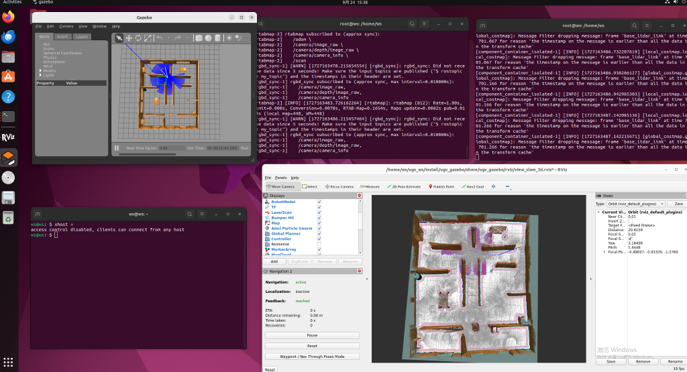

# 基于NavGPT-2与ROS2的交互式自主导航
## 1.项目简介
本项目基于清华大学NavGPT-2具身智能模型与ROS2路径规划算法，实现了机器人通过自然文本指令进行自主导航的功能。系统支持多模态交互，具备高环境理解与动态避障能力，提升了智能机器人在复杂场景下的自主性与人机协作效率。

## 2.导航演示视频




## 3.实物展示
**模拟小车：**


**实际项目车辆：**


## 4.ROS2路径规划算法选择
- **全局路径规划：** 本项目采用`Theta*`

| 算法名称	| 最优性    | 完备性      | 空间复杂度 | 时间复杂度 | 适用环境 |
|:---------:|:---------:|:---------:|:---------:|:---------:|:---------:|
| A*	      | 是	    |是         |中         |低         |静态        |
| Dijkstra	| 是      |是         |高         |高         |静态          |
| RRT	      | 否      |概率       |低         |低         |动态        |
| RRT*	    | 否      |概率       |高         |高         |动态          |
| Theta*	  | 是      |是         |中         |中         |静态        |

- **局部路径规划：** 本项目采用`TEB`

| 算法名称	| 实时性    | 避障能力      | 约束    | 可靠性     |
|:---------:|:---------:|:---------:|:---------:|:---------:|
| DWA*	    | 高	    |更快         |瞬时速度，加速度    |低  |
| TEB	      | 中      |更平滑       |最大速度，最大加速度 |中  |
| MPC	      | 低      |前瞻性更好    |自定义             |高  |

## 5.安装
- 0.基础需求(推荐)
  - 系统：`Ubuntu 22.04 LTS`	
  - NVIDIA驱动：`500.00.01` 或 更高
  - CUDA Toolkit:	`11.8` 或 `12.1`
  - Anaconda: `Anaconda3 2023.02`
  - python: `python>=3.8`
  - ROS2: `hunble`
- 1.下载
  - **注：以下操作均基于配置好ROS2的Ubuntu环境中操作，如缺少软件包可根据提示安装，推荐使用docker环境。**
```bash
git clone https://github.com/successfulbarrier/Path-Planning-Ros2-humble.git
cd Path-Planning-Ros2-humble
./build_first.sh
```
- 2.安装依赖
```bash
pip install -r requirements.txt
pip install -r NavGPT-v2/requirements.txt
```

## 6.使用
- 1.自动下载NavGPT-v2模型，从国外huggingface网站下载，需要梯子。
```bash
python ./NavGPT-v2/download.py --checkpoints
```
- 2.与训练权重链接，若无法自动下载，也可以通过国内huggingface镜像网站手动下载。
<table border="1" width="100%">
    <tr align="center">
        <th>Model</th><th>Log</th><th colspan="5">R2R unseen</th><th colspan="5">R2R test</th>
    </tr>
    <tr align="center">
        <td></td><td></td><td>TL</td><td>NE</td><td>OSR</td><td>SR</td><td>SPL</td><td>TL</td><td>NE</td><td>OSR</td><td>SR</td><td>SPL</td>
    </tr>
    <tr align="center">
        <td><a href="https://huggingface.co/ZGZzz/NavGPT2-FlanT5-XL/tree/main">NavGPT2-FlanT5-XL</a></td><td><a href="assets/NavGPT2-FlanT5-XL.log">here</a></td><td>12.81</td><td>3.33</td><td>78.50</td><td>69.89</td><td>58.86</td><td>13.51</td><td>3.39</td><td>77.38</td><td>70.76</td><td>59.60</td>
    </tr>
    <tr align="center">
        <td><a href="https://huggingface.co/ZGZzz/NavGPT2-FlanT5-XXL/tree/main">NavGPT2-FlanT5-XXL</a></td><td><a href="assets/NavGPT2-FlanT5-XXL.log">here</a></td><td>14.04</td><td>2.98</td><td>83.91</td><td>73.82</td><td>61.06</td><td>14.74</td><td>3.33</td><td>80.30</td><td>71.84</td><td>60.28</td>
    </tr>
</table>

- 3.手动下载后将模型文件拷贝到`./NavGPT-v2/checkpoints`文件夹下。
- 4.运行NavGPT-v2推理节点。
```bash
# 运行该节点会创建一个名字为NavGPTv2的话题.
# 图像和雷达数据较多，通过共享内存的方式传输。
./NavGPT-v2/ros2_Inference.py
```
- 5.运行
```bash
python ./ros2_humble.sh
```

## 7.参考
- [NavGPT-v1 Paper](https://arxiv.org/abs/2305.16986)
- [NavGPT-v1 Code](https://github.com/GengzeZhou/NavGPT)
- [NavGPT-v2 Paper](https://arxiv.org/abs/2407.12366)
- [NavGPT-v2 Code](https://github.com/GengzeZhou/NavGPT-2)
## 8.许可证
- 本项目采用`AGPL-3.0`，许可证的详细信息参考`LICENSE`文件.

## 9.贡献
- 欢迎提交 Issue 和 Pull Request！
